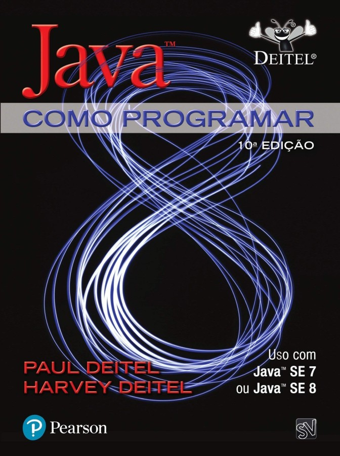

# Programação Orientada a Objetos

Prof. Eduardo Ono

 

## Bibliografia

| Capa | Descrição |
| :-: | --- |
|  | [DEITEL_2017]  DEITEL, Paul.; DEITEL, Harvey; [**Java: Como Programar, 10. ed.**](https://plataforma.bvirtual.com.br/Acervo/Publicacao/39590), São Paulo: Pearson Education do Brasil, 2017.

 
